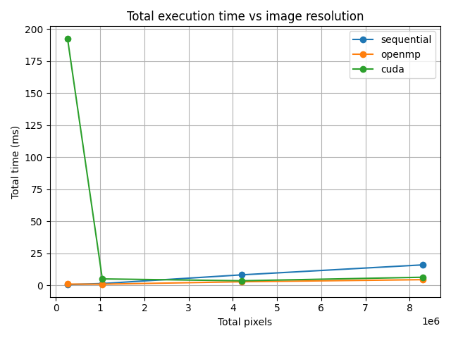
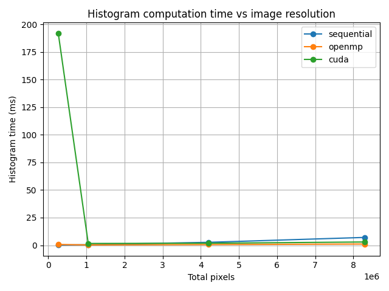
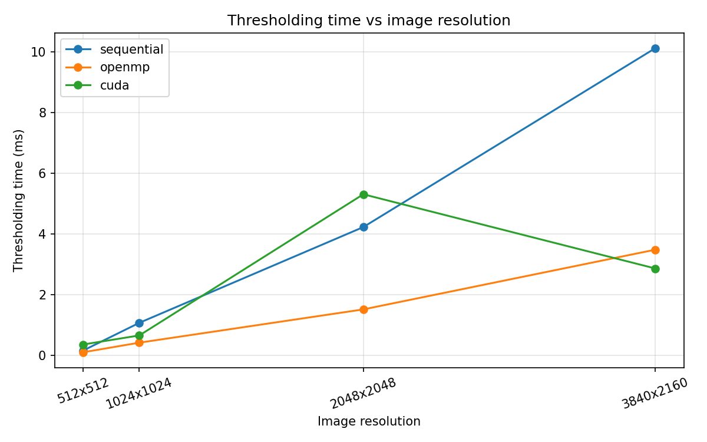
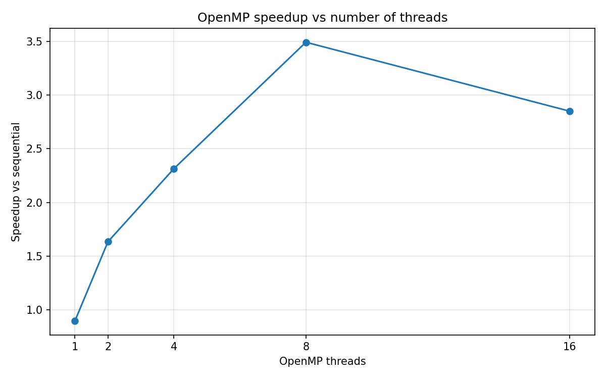
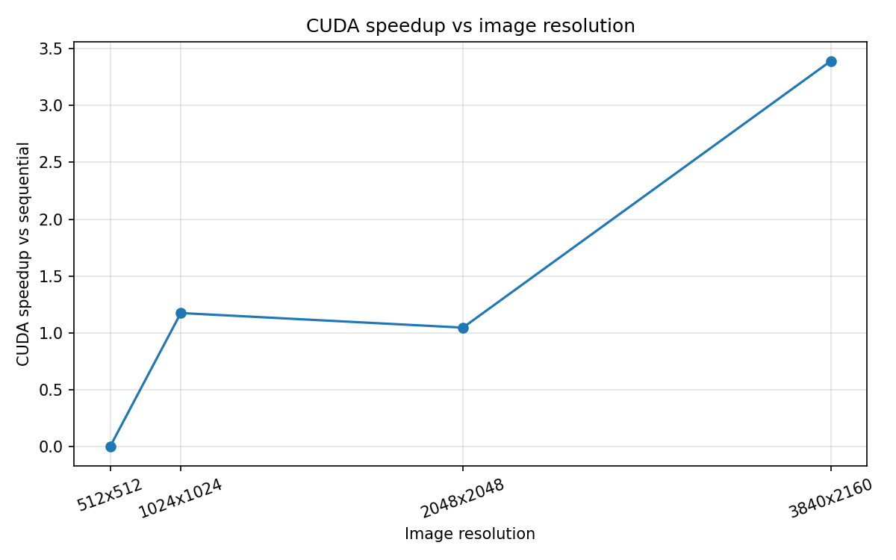

# OpenMP vs CUDA for Otsu Thresholding and Binary Image Segmentation

## 1. Introduction

This project compares three implementations of Otsu Thresholding and binary image segmentation:

- a sequential C++ implementation used as the baseline
- an OpenMP implementation running on a multi-core CPU
- a CUDA implementation running on an NVIDIA GPU

The goal is to measure how the main stages of the algorithm behave when image resolution increases. The benchmark records histogram computation time, Otsu threshold computation time, binary thresholding time, total execution time, and speedup compared with the sequential baseline.

## 2. Otsu Thresholding

Otsu Thresholding is an automatic method for choosing a grayscale threshold. For an 8-bit grayscale image, the algorithm first computes a histogram with 256 bins. It then tests all possible thresholds from 0 to 255 and selects the threshold that maximizes the between-class variance between the background and foreground pixel groups.

The threshold search is computationally small because it always loops over only 256 histogram bins, regardless of the image resolution. For this reason, the performance-relevant parts of the program are the stages that touch every pixel: histogram computation and applying the binary threshold.

## 3. Binary Segmentation

After the Otsu threshold is selected, each pixel is converted into a binary value:

- pixels greater than the threshold become 255
- pixels less than or equal to the threshold become 0

The output is a segmented black-and-white PGM image. Each implementation writes its own output image, and the OpenMP and CUDA outputs are validated against the sequential output.

## 4. Sequential Implementation

The sequential implementation uses standard C++ loops. It performs the following steps:

1. Read a PGM P5 grayscale image.
2. Compute the 256-bin histogram.
3. Compute the Otsu threshold from the histogram.
4. Apply the binary threshold to all pixels.
5. Save the output image.

This version is used as the correctness and performance baseline.

## 5. OpenMP Implementation

The OpenMP implementation parallelizes the pixel-level work on the CPU. Histogram computation uses per-thread local histograms to reduce contention, then combines the local histograms into the final 256-bin histogram. Threshold application is parallelized with an OpenMP `parallel for`, because each output pixel can be computed independently.

OpenMP improves processing time because multiple CPU cores can process different parts of the image at the same time. The speedup is not perfectly linear because of thread creation overhead, memory bandwidth limits, scheduling overhead, and the reduction step needed to merge local histograms.

## 6. CUDA Implementation

The CUDA implementation moves the pixel-level work to the GPU. The histogram stage uses a CUDA kernel with shared memory and atomic operations. The thresholding stage uses a separate CUDA kernel where each thread processes one pixel.

CUDA can be faster for larger images because the GPU can launch many lightweight threads and process a large number of pixels in parallel. However, CUDA total time also includes host-device memory allocation and memory transfers. These overheads are especially visible for small images, where the actual computation is too small to compensate for the CPU-GPU transfer cost.

## 7. Experimental Setup

- CPU: Intel i7-14700F
- GPU: NVIDIA RTX 4060
- Operating system: Windows 11
- Compiler/toolchain: MSVC, NVCC, CMake
- Build mode: Release
- Image format: binary PGM P5 grayscale images
- OpenMP thread counts: 1, 2, 4, 8, 16

The benchmark validates that OpenMP and CUDA produce the same histogram, threshold, and output image as the sequential implementation before results are accepted.

## 8. Dataset

The dataset contains synthetic grayscale PGM images with different resolutions:

- 512 x 512
- 1024 x 1024
- 2048 x 2048
- 3840 x 2160

PGM P5 images are used because the format is simple to load and save directly in C++ without requiring OpenCV or another image-processing library.

## 9. Results

The benchmark results are stored in `results/`. The Release benchmark CSV files are:

- `results_release_threads_1.csv`
- `results_release_threads_2.csv`
- `results_release_threads_4.csv`
- `results_release_threads_8.csv`
- `results_release_threads_16.csv`

The following graphs were generated from those CSV files.

### Total Execution Time

### Histogram Computation Time

### Thresholding Time

### OpenMP Speedup

### CUDA Speedup

## 10. Interpretation

For the 3840 x 2160 image in the 16-thread run, the sequential total time was about 16.65 ms, OpenMP total time was about 5.84 ms, and CUDA total time was about 4.91 ms. This corresponds to an OpenMP speedup of about 2.85x and a CUDA speedup of about 3.39x for the largest image in that run.

OpenMP performs well because the histogram and thresholding stages process many pixels and can be split across CPU cores. The 8-thread run produced the best OpenMP speedup for the largest image in this benchmark, about 3.49x. The 16-thread run was slower than the 8-thread run, showing that adding more threads does not always improve performance. The likely causes are memory bandwidth pressure, thread scheduling overhead, and the extra reduction work for histogram merging.

CUDA shows the strongest advantage on larger images. For small images, the CUDA total time is dominated by setup and memory transfer overhead, so it can be much slower than the CPU implementations. This is visible for the 512 x 512 image, where the GPU computation itself is small but the total CUDA time includes host-device work. As the image resolution grows, the large amount of parallel pixel work makes the GPU more competitive.

The Otsu threshold computation time is almost negligible in all implementations. This is expected because it only scans 256 histogram bins. Image size mostly affects histogram computation and binary thresholding, because those stages scale with the number of pixels.

The results also show that speedup is not always linear. Parallel performance depends not only on the number of threads or GPU cores, but also on memory access patterns, synchronization, reductions, data transfer overhead, and the fixed overhead of launching parallel work.

## 11. Conclusion

The project confirms that both OpenMP and CUDA can accelerate Otsu Thresholding and binary segmentation compared with a sequential C++ implementation. OpenMP is easy to integrate and gives strong CPU performance for medium and large images. CUDA has higher overhead, especially for small images, but becomes effective when the image is large enough for GPU parallelism to compensate for memory transfer and launch costs.

For this algorithm, the main optimization targets are histogram computation and threshold application. The Otsu threshold selection step is too small to dominate runtime because it only processes 256 histogram bins.
